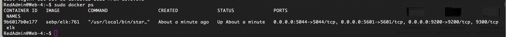

# Cloud Network
This is a collection of Linux Scripts and Ansible Scripts from my CyberClass.

Most of the scripts are used to configure cloud servers with differnt docker containers.

The final setup was four servers, running vulnerable DVWA containers, along with a jump box and a server running an ELK stack container.

